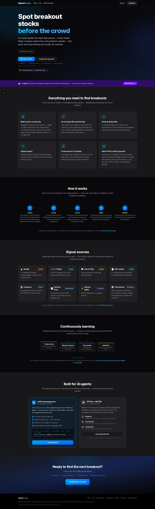

# SignalScope

SignalScope is an open-source stock breakout signal detection platform. It harvests signals from eight public sources, scores tickers with AI, filters pump-and-dump candidates, stages emerging consensus (Early → Forming → Confirmed), and surfaces validated opportunities in a dashboard, portfolio tools, and REST APIs.

Every harvest run is stored in PostgreSQL with forward price snapshots (1d–30d returns). Recommendation thresholds and methodology are **backtested over those historical scans** using a LightGBM pipeline — not tuned by hand. You can export scan data, train models offline, and adopt improved features or cutoffs via the experiment log (see [ML model training](#ml-model-training) below).



**Capabilities at a glance**

| Area | What you get |
|------|----------------|
| **Sources** | Reddit, X/Twitter, StockTwits, SEC insider filings, congressional trades, volume spikes, options flow (net premium), Polymarket |
| **Scoring** | Batch AI scoring with hard-rule overrides; Opportunity Score (early-mover rank) and AI Score (evidence strength) |
| **Safety** | 11-flag pump-and-dump detector plus AI edge-case review |
| **Labels** | Deterministic Strong Buy / Buy / Watch / Avoid from score, stage, source mix, market-cap tier, and P&D flags |
| **Backtesting** | Post-scan return tracking, LightGBM feature/threshold experiments, public methodology and result views |
| **Product** | Cross-scan trending, on-demand AI ticker reports, watchlist, email alerts, x402 pay-per-call API |
| **Ops** | Runs locally or on any container host — no cloud provider required; optional remote harvester when sources block datacenter IPs |

Released under the [MIT License](LICENSE). Questions and bug reports: [GitHub Issues](https://github.com/aleibovici/signalscope/issues). Security: [Security Advisories](https://github.com/aleibovici/signalscope/security).

## Architecture: web app vs harvester

SignalScope runs as **two processes**:

```text
Signal sources ──► Harvester container ──POST /api/harvest/ingest──► Web app (Next.js)
                                                                      │
                                                                      ▼
                                                                 PostgreSQL
                                                                      │
                                                         Dashboard UI + public/API
```

| Runtime | What it is | Entry points |
|---------|------------|--------------|
| **Web app** | Next.js UI, Auth, REST APIs, AI scoring/P&D on ingest, DB writes, optional scheduled jobs (snapshots, reports, alerts) | `Dockerfile`, `docker compose` service `web`, or `npm run dev` |
| **Harvester** | Separate Node process that **fetches** raw signals from external sources, then POSTs them to the web app ingest endpoint | `Dockerfile.harvester`, compose profile `harvest`, `npm run harvest` → `scripts/run-harvest-remote.ts` |

Why separate? Some sources block datacenter IPs. The harvester can run on a network that can reach those sources while the web app runs on any host. The harvester is **optional** for UI development if you already have data (seed + prior scans).

Auth for ingest: header `x-harvest-key` must match `HARVEST_API_KEY` on the web app. Set `HARVEST_ENDPOINT_URL` on the harvester to your web app’s ingest URL (e.g. `http://localhost:3000/api/harvest/ingest`).

## Repository map

- `src/app/` — App Router UI and API routes
- `src/lib/harvester/` — Signal pipeline (fetch helpers, scoring, P&D, DB write) used by ingest processing
- `scripts/run-harvest-remote.ts` — Harvester entry (fetch locally, POST to web)
- `prisma/` — Schema, migrations, seed
- `public/skill/` — API docs for humans and agent clients
- `docker-compose.yml` — Postgres + web; harvester via `--profile harvest`
- `docker-compose.harvest.yml` — Standalone harvester against a remote ingest URL
- `scripts/backtesting-experiments.md` — ML experiment log (LightGBM feature/threshold runs)
- `scripts/extract.py` — Export Postgres tables to parquet for offline model training
- `DEPLOYMENT.md` — Local, Docker, and container-host deployment plus scheduled jobs

## ML model training

The web app **collects and labels** data (signals, fundamentals, forward returns); model training runs **outside** the app. Export tables with `scripts/extract.py`, train on parquet under `scripts/output/`, and track runs in `scripts/backtesting-experiments.md`. The in-app methodology page summarizes the current LightGBM setup and validated thresholds.

**We recommend [Karpathy’s autoresearch](https://github.com/karpathy/autoresearch)** for iterative training: an autonomous loop that edits training code, runs experiments, and keeps changes that improve validation metrics. When you adopt new features or cutoffs, log the winning run in `scripts/backtesting-experiments.md` and wire the thresholds into `src/lib/harvester/recommendation.ts` (see `scripts/calibrate-recommendation.ts`).

## Prerequisites

- Node.js 22+
- PostgreSQL 16+ (Docker Compose provides one; a local install or any managed Postgres works too)
- At least one AI provider key (`OPENAI_API_KEY` and/or `ANTHROPIC_API_KEY`) for scoring and reports

SignalScope is cloud-agnostic: it needs a PostgreSQL URL and somewhere to run a
Node 22 container. There are no provider SDKs, no managed-service dependencies,
and no infrastructure-as-code tied to a specific cloud. See [DEPLOYMENT.md](DEPLOYMENT.md).

## Quick start (web app + database)

```bash
git clone https://github.com/aleibovici/signalscope.git
cd signalscope
cp .env.example .env
```

Edit `.env` and set at least:

- `AUTH_SECRET` — `openssl rand -base64 32`
- `DATABASE_URL` — default in `.env.example` matches Docker Postgres below
- `NEXT_PUBLIC_APP_URL` — `http://localhost:3000` for local dev
- `OPENAI_API_KEY` and/or `ANTHROPIC_API_KEY`

```bash
docker compose up db -d
npm install
npm run db:generate
npm run db:migrate
npm run db:seed
npm run dev
```

Open `http://localhost:3000`.

**Local seed login** (credentials provider login id — local only, not a contact address):

- Login id: `dev@localhost`
- Password: `password123`
- Role: admin

The seed refuses to run against a non-local database host unless you set
`SEED_ALLOW_REMOTE=1`, and `SEED_ADMIN_PASSWORD` overrides the default password.

### Docker: web + DB in one command

```bash
cp .env.example .env
docker compose up --build
```

This starts Postgres, applies migrations, and serves the app on `http://localhost:3000`.
Requires Docker Compose v2.24+.

## Running the harvester

1. Web app must be running and reachable from the harvester host.
2. Set the same secret on both sides:

```bash
# on the web app (.env)
HARVEST_API_KEY=<openssl rand -base64 32>

# on the harvester
HARVEST_API_KEY=<same value>
HARVEST_ENDPOINT_URL=http://localhost:3000/api/harvest/ingest
```

Optional source credentials (e.g. `X_BEARER_TOKEN`) improve coverage; many sources work without paid APIs.

**npm (same machine as the repo):**

```bash
npm run harvest
```

**Docker Compose profile (uses `Dockerfile.harvester`):**

```bash
docker compose --profile harvest run --rm harvester
```

**Against a remote web app:**

```bash
docker compose -f docker-compose.harvest.yml --env-file .env run --rm harvester
```

## Optional integrations

All of these are env-gated; omit the vars to disable:

- Stripe subscriptions
- Resend outbound notifications (`RESEND_API_KEY` + `EMAIL_FROM` — you supply a verified sender for your own mail provider; none is bundled)
- x402 pay-per-call (`X402_WALLET_ADDRESS`)
- Broker paper trading (Alpaca, etc.)
- X/Twitter signal harvest (`X_BEARER_TOKEN` — read-only search for the harvester)
- Google Tag Manager / GA4 analytics (`NEXT_PUBLIC_GTM_ID`, `NEXT_PUBLIC_GA4_MEASUREMENT_ID`)
- IndexNow submissions (`INDEXNOW_KEY` + `CRON_SECRET`)

## Deployment and scheduled jobs

[DEPLOYMENT.md](DEPLOYMENT.md) covers running the container anywhere, database
migrations, reverse-proxy settings, and the recurring jobs (price snapshots, AI
reports, alerts, broker sync). Every job is an HTTP endpoint guarded by a shared
secret, so plain cron, systemd timers, Kubernetes CronJobs, GitHub Actions, or a
managed scheduler all work.

## Tests and lint

```bash
npm run lint
npm test
```

## Contributing and security

- [CONTRIBUTING.md](CONTRIBUTING.md)
- [CODE_OF_CONDUCT.md](CODE_OF_CONDUCT.md)
- [SECURITY.md](SECURITY.md) — report vulnerabilities via GitHub Security Advisories

## License

[MIT](LICENSE) — Copyright (c) 2026 SignalScope contributors
